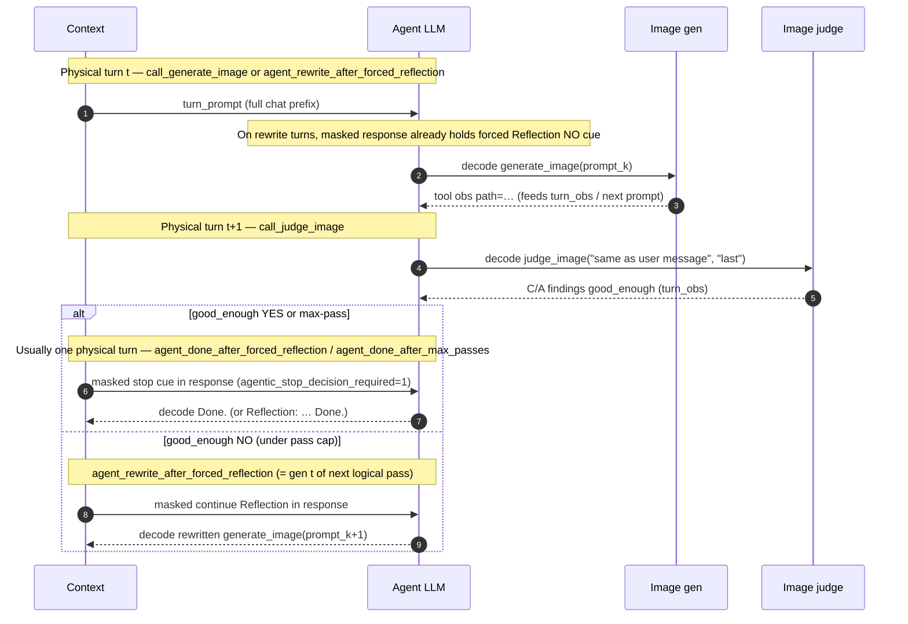

# Agentic LLM GRPO trainer

Last updated: 08/12/2026

Training recipes for **Agentic LLM RL** with GRPO ([#302](https://github.com/verl-project/verl-omni/issues/302)).
This folder covers the agent-LLM + frozen-tool loop (gen → judge → reflect / Done), not the full
Reflection–Plan Co-Optimization (RPCO) design from the RFC.
In this example, we conduct LoRA overfitting on this, where the Agent LLM, image
gen tool, and image judge can be **changed** as you need; this example uses:

- **Agent LLM** (`agent_llm/`): LoRA-train via `MODEL_PATH` (default `Qwen3-VL-2B-Instruct`; `Qwen3.5` also works).
- **Image gen** (`:8092`, `run_image_gen_tool_server.sh`): frozen diffusion — `generate_image` (model via `IMAGE_GEN_MODEL`, default Qwen-Image / vLLM-Omni).
- **Image judge** (`:8093`, `run_judge_image_tool_server.sh`): frozen VLM — live `judge_image`; reward prefers that C/A obs (model via `JUDGE_IMAGE_MODEL`, default Qwen3-VL).
- **Reward** (`agentic_reward`): Hermes/`<tool_call>` protocol + gated C/A + Done / ΔC (fewshot format must match the actor template).

Target protocol (fewshot + on-policy) — see **Multi-turn Behaviors** diagrams:

```
Turn k:
  1. generate_image(prompt_k) → image_k
  2. judge_image("same as user message", "last") → VL feedback
  3. forced Reflection (mask=0) then:
    good_enough: YES / max-pass → stop cue → policy samples Done. (mask=1)  OR
    good_enough: NO → policy rewrite + generate_image(prompt_{k+1}) → Turn k+1
```

Fewshot demos in `create_dummy_agentic_data.py` follow that order. They are
**GRPO exploration examples**, not supervised targets. Overfit fewshot omits the
terminal `Done.` so the live turn cannot copy Done-without-tools. Regenerate
parquet when switching actor family so fewshot `<tool_call>` syntax matches the
chat template.

## Rollout Trajectories

Each training step dumps per-rollout JSON under
`outputs/e2e/<run>/rollout_trajectories/step_XXXXXX/sample_{dataset}.{rollout_n}.json`
and matching PNGs under `rollout_images/…/sample_Y.ZZ/image_NN_<artifact_id>.png`.

Typical force-on trajectory (`AGENTIC_FORCE_REFLECTION_AFTER_JUDGE=1`):


## Reward components

`compute_score` returns a scalar `score` plus per-component fields. WandB
`agentic_reward/*` logs **only the scalar mix terms** (via
`agentic_metrics_manager.REWARD_COMPONENTS`):

- `agentic_reward/tool_call/{mean,min,max}`
- `agentic_reward/correctness/{mean,min,max}`
- `agentic_reward/aesthetics/{mean,min,max}`
- `agentic_reward/done/{mean,min,max}`

`reward_correctness` / `reward_aesthetics` prefer the last successful
`agentic_judge ok=1` observation already in the trajectory (same C/A the actor
saw). If absent, reward falls back to `AGENTIC_VLLM_URL` (OpenAI chat).
Per-dimension facet fields may still appear in
`hermes_actions` JSONL but are **not** logged under `agentic_reward/*`.

**Overfit learning signal:** open `generate→judge` loops no longer keep a mid
plateau from high frozen-judge C/A. Scalar mix credits C/A fully only after a
successful PNG + successful judge + policy-sampled terminal `Done.`. A masked
forced Reflection may supply the reflection context, but never the terminal
action. Incidental prose such as “Stop when Done.” earns zero Done credit, and
blocked/no-PNG trajectories cannot close the protocol. The launch script sets LoRA `actor.optim.lr=1e-4`
(verl default `1e-6` was too small to move reward in 100 steps).


## Multi-turn Behaviors (three turns max)

### Physical turns (trajectory JSON) in gen→judge→reflect

A **physical turn** is one object in `rollout_turns[]` with
`turn`, `turn_kind`, `turn_prompt`, `turn_obs`, `decode`, and `response`.
Dumps look like `rollout_trajectories/step_XXXXXX/sample_{dataset}.{rollout_n}.json`
(e.g. `sample_1.00.json`). On a rewrite after NO
(`turn_kind=agent_rewrite_after_forced_reflection`): `turn_prompt` is the full
chat prefix, `turn_obs` is the latest `judge_image` tool response, masked env
`response` holds the forced `Reflection: … agentic_forced_reflection=1` continue
cue, and policy `decode` is the rewritten Hermes `generate_image` call.
On YES / max-pass stop, the stop cue lands in `response` and the policy samples
terminal `Done.` (or `Reflection: … Done.`) in `decode`
(`agent_done_after_forced_reflection` / `agent_done_after_max_passes`).

One **logical** pass (generate → judge → decide) is usually **2 physical turns**,
or **3** when the post-judge decision is its own row:

| Physical `turn` | Typical `turn_kind` | Policy `decode` | Env `response` (often mask=0) |
| ---: | --- | --- | --- |
| *t* | `call_generate_image` (first pass) **or** `agent_rewrite_after_forced_reflection` | Hermes `generate_image(…)` | empty on first gen; on rewrite, forced `Reflection: … good_enough=NO … agentic_forced_reflection=1` |
| *t+1* | `call_judge_image` | Hermes `judge_image("same as user message", "last")` | empty (`turn_obs` carries the VL judge text) |
| *t+2* if YES | usually `agent_done_after_forced_reflection` | policy `Done.` or `Reflection: … Done.` | forced stop cue in the same turn (`agentic_stop_decision_required=1`); a lone `forced_reflection_stop_cue` row is rare |
| *t+2* if NO | `agent_rewrite_after_forced_reflection` | rewritten `generate_image(…)` | forced continue `Reflection:` (this row is also gen *t* of the next logical pass) |
| *t+2* if max-pass | usually `agent_done_after_max_passes` | policy `Done.` / `Reflection: … Done.` | stop cue with `agentic_force_stop_max_passes=1` (occasionally a dangling `forced_reflection_max_passes_stop_cue` if Done was not sampled) |

Examples from `rollout_trajectories/` (max `AGENTIC_MAX_GENERATE_IMAGE_PASSES=3`):

- Early YES: `call_generate_image` → `call_judge_image` → `agent_done_after_forced_reflection`
- One rewrite then YES: `call_generate_image` → `call_judge_image` → `agent_rewrite_after_forced_reflection` → `call_judge_image` → `agent_done_after_forced_reflection`
- All-NO to cap: `…` → `agent_rewrite_after_forced_reflection` → `call_judge_image` → `agent_done_after_max_passes`



### Rollout trajectory JSON protocol

Each ``rollout_trajectories/step_XXXXXX/sample_Y.ZZ.json`` lists ``rollout_turns``
with this key order:

| Key | Meaning |
| --- | --- |
| `turn` | 1-based index in the response tensor |
| `turn_kind` | Grepable stage label (see **Rollout Trajectories** table) |
| `turn_prompt` | Chat context / prior obs the policy conditions on for this decode |
| `decode` | Policy-sampled assistant tokens (`<tool_call>…` or prose) |
| `response` | Injected assistant text after the tool obs (forced Reflection when force=1) |
| `decode_has_tool_call` | `true` iff **`decode`** contains `<tool_call>` (ignores `response`) |


## Judge `good_enough` Gate
```
VLM JSON
  → parse facets (or scalar C/A)
  → snap each facet to {0.0, 0.2, 0.4, 0.6, 0.8, 1.0}
       ([0.9, 1.0) → 0.8; only exact 1.0 stays 1.0)
  → rubber_stamp?
       raw C facets all identical & ≥0.9
       OR raw A facets all identical & ≥0.9
       OR (scalar-only) raw C≥0.9 and raw A≥0.9
     if yes: cap snapped facets at 0.8, annotate findings, stamp=1
  → C = mean(correctness facets), A = mean(aesthetics facets)
  → YES ⇔ (not rubber_stamp) AND C ≥ thr AND A ≥ thr
       thr = AGENTIC_JUDGE_GOOD_ENOUGH_THRESHOLD (default 0.80)
```

### The rubber stamp for meaningful rewards
Frozen VLMs (Qwen3.5-9B in our case) sometimes emit identical near-max facets (all ~0.95/1.0) with vague “perfectly matches” findings. Without a gate, that becomes an easy first-pass good_enough=YES → forced stop → Done., so the policy never learns rewrite. Rubber-stamp does the following:

1. Detects flat raw facets ≥ 0.9 (or scalar C/A both ≥ 0.9)
2. Soft-caps snapped facets to 0.8 (keeps C/A for reward)
3. Forces good_enough=NO even if means still look like 0.8
4. Annotates findings with [client] rubber-stamp…
5. Legitimate discrete flat 0.8 is not stamped (so rewrite→YES remains possible).

## 100-step overfit e2e (recommended)

Goal: overfit a tiny prompt pool so the policy learns
**`generate_image` → `judge_image` → (forced Reflection, mask=0) → policy `Done.` or rewrite**.
Preferred closed path is **NO → one rewrite → YES → Done** (`reward_rewrite_yes`);
all-NO through `AGENTIC_MAX_GENERATE_IMAGE_PASSES` (default 3) then max-pass Done
remains allowed but scores lower.

### 1) Start frozen tools

Prefer **judge first**, then image gen, when they share a GPU (CPU-offload image gen).

Pane A — image judge (`judge_image` + reward C/A fallback):

```bash
  bash examples/agenticllmgrpo_trainer/agent_llm/run_judge_image_tool_server.sh
# listens on :8093; middleware forces enable_thinking=false by default
```

Pane B — image gen (`generate_image`):

```bash
  bash examples/agenticllmgrpo_trainer/agent_llm/run_image_gen_tool_server.sh
# listens on :8092 (vLLM-Omni / Qwen-Image)
```

Restart the **image** sidecar after changing `QWEN_IMAGE_STEPS` / CFG / resolution.
Restart the **judge** sidecar after changing `JUDGE_IMAGE_MODEL` / GDN / middleware.
`AGENTIC_JUDGE_GOOD_ENOUGH_THRESHOLD` is client-side (trainer parse) — restart
**trainer** only to pick up thr / rubber-stamp / reward changes.

Without an image service, `generate_image` returns a text stub and the launcher
refuses to train (set `REQUIRE_REAL_IMAGE_TOOL=0` only for plumbing diagnostics).

### 2) Run GRPO — pane C

```bash
TOTAL_STEPS=100 N_GPUS=2 \
  bash examples/agenticllmgrpo_trainer/agent_llm/run_agentic_grpo_lora.sh
```

The launcher regenerates overfit parquet (`--with_fewshot`, Hermes) then runs
`python3 -m verl.trainer.main_ppo` with `default_agent_loop=agentic_tool_agent`
and an explicit `+…agent_loop_manager_class=…AgenticMetricsAgentLoopManager`
(registered via `VERL_USE_EXTERNAL_MODULES=verl_omni`).

| Step | Behavior |
| --- | --- |
| Entry | `verl.trainer.main_ppo` + `VERL_USE_EXTERNAL_MODULES=verl_omni` |
| Template | Native tool template (Hermes for Qwen3-VL; XML for Qwen3.5) |
| Data | Regenerated `TRAIN_FILE` / `VAL_FILE` (`data/agentic/{train,val}.parquet`) |
| Agent loop | `agentic_tool_agent` + `AgenticMetricsAgentLoopManager` (Hydra): force-first gen; forced Reflection after judge; YES/max-pass → policy `Done.` |
| Tools | `examples/agenticllmgrpo_trainer/function_tools/tools.py`: `generate_image` + `judge_image` |
| Observation | text tool obs (`path=`, judge C/A / `good_enough`); PNGs under `rollout_images/` |
| Reward | `agentic_reward`: tool_call + gated C/A + Done + ΔC + `reward_rewrite_yes`; prefer live `agentic_judge ok=1` |
| Artifacts | `outputs/e2e/<experiment>/{rollout_trajectories,rollout_images,hermes_actions}/` |


### Data-only refresh (no train)

```bash
python3 examples/agenticllmgrpo_trainer/data_process/create_dummy_agentic_data.py \
  --local_save_dir data/agentic \
  --overfit --train_size 8 --val_size 2 \
  --with_fewshot --tool_call_format hermes \
  --model_path "$MODEL_PATH"
```

Overfit pool is `USER_PROMPTS[0::2]` (soldier + cafe poster). With `--with_fewshot`:

| Prompt | Fewshot |
| --- | --- |
| soldier (idx=0) | Class-1 two-pass same-task demo (ends on YES judge, **no** terminal `Done.`) |
| cafe poster (idx=2) | system + user only (no baked demo; avoids copying soldier content) |